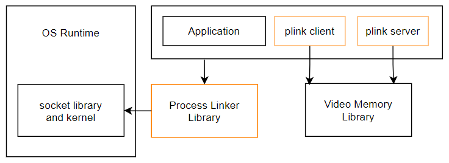
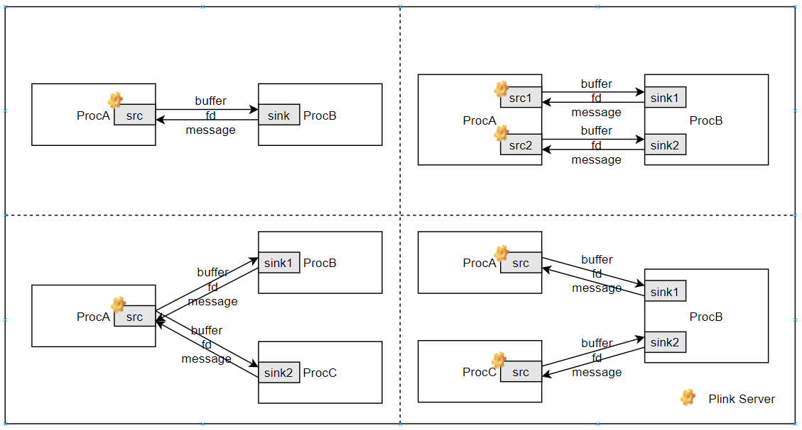
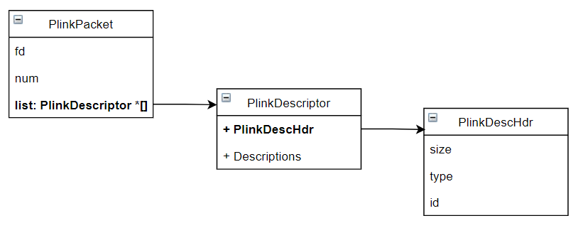

---

title: 视语融合Process Linker软件用户手册
author: 楼展
creator: 平头哥半导体有限公司
subject: API document
keywords: [Light, API, Process Linker]
---


# 视语融合Process Linker软件用户手册

版本 0.1.1

发布日期 2022-5-10

<div style="page-break-before:always" />

**Copyright © 2021-2022 T-HEAD Semiconductor Co.,Ltd. All rights reserved.**

This document is the property of T-HEAD Semiconductor Co.,Ltd. This document may only be distributed to: (i) a T-HEAD party having a legitimate business need for the information contained herein, or (ii) a non-T-HEAD party having a legitimate business need for the information contained herein. No license, expressed or implied, under any patent, copyright or trade secret right is granted or implied by the conveyance of this document. No part of this document may be reproduced, transmitted, transcribed, stored in a retrieval system, translated into any language or computer language, in any form or by any means, electronic, mechanical, magnetic, optical, chemical, manual, or otherwise without the prior written permission of T-HEAD Semiconductor Co.,Ltd.

**Trademarks and Permissions**

The T-HEAD Logo and all other trademarks indicated as such herein are trademarks of T-HEAD Semiconductor Co.,Ltd. All other products or service names are the property of their respective owners.

**Notice**

The purchased products, services and features are stipulated by the contract made between T-HEAD and the customer. All or part of the products, services and features described in this document may not be within the purchase scope or the usage scope. Unless otherwise specified in the contract, all statements, information, and recommendations in this document are provided "AS IS" without warranties, guarantees or representations of any kind, either express or implied.

The information in this document is subject to change without notice. Every effort has been made in the preparation of this document to ensure accuracy of the contents, but all statements, information, and recommendations in this document do not constitute a warranty of any kind, express or implied.

**Copyright © 2021-2022 平头哥半导体有限公司，保留所有权利.**

本文档的所有权及知识产权归属于平头哥半导体有限公司及其关联公司(下称“平头哥”)。本文档仅能分派给：(i)拥有合法雇佣关系，并需要本文档的信息的平头哥员工，或(ii)非平头哥组织但拥有合法合作关系，并且其需要本文档的信息的合作方。对于本文档，未经平头哥半导体有限公司明示同意，则不能使用该文档。在未经平头哥半导体有限公司的书面许可的情形下，不得复制本文档的任何部分，传播、转录、储存在检索系统中或翻译成任何语言或计算机语言。

**商标申明**

平头哥的LOGO和其它所有商标归平头哥半导体有限公司及其关联公司所有，未经平头哥半导体有限公司的书面同意，任何法律实体不得使用平头哥的商标或者商业标识。

**注意**

您购买的产品、服务或特性等应受平头哥商业合同和条款的约束，本文档中描述的全部或部分产品、服务或特性可能不在您的购买或使用范围之内。除非合同另有约定，平头哥对本文档内容不做任何明示或默示的声明或保证。

由于产品版本升级或其他原因，本文档内容会不定期进行更新。除非另有约定，本文档仅作为使用指导，本文档中的所有陈述、信息和建议不构成任何明示或暗示的担保。平头哥半导体有限公司不对任何第三方使用本文档产生的损失承担任何法律责任。

**平头哥半导体有限公司 T-HEAD Semiconductor Co.,LTD**

地址: 杭州市西湖区西斗门路3号天堂软件园A座15楼 邮编: 310012
网址: www.t-head.cn

<div style="page-break-before:always" />

# 修订历史

| 版本号 | 版本说明 | 修订人 | 日期      |
| ------ | ----------------------------- | ---- | --------- |
| 0.0.1  | 初始版本 | 楼展 | 2021-9-15 |
| 0.1.1 | 添加Bayer RAW相关数据类型<br />添加connect和recv超时接口：PLINK_recv_ex()，PLINK_connect_ex() | 楼展 | 2022-5-10 |
|        |          |      |           |

<div style="page-break-before:always" />

# 目录

[TOC]

<div style="page-break-before:always" />

# 概述

本文档对视语融合项目Process Linker模块做详细介绍和说明。文档内容包括系统架构简述，Process Linker功能描述，编程指南以及接口函数、数据结构和枚举的详细介绍。

<div style="page-break-before:always" />

# 约定

| 格式          | 说明                       |
| ------------- | -------------------------- |
| 黑体          | 正文采用黑体表示           |
| **粗体**      |                            |
| *斜体*        |                            |
| <u>下划线</u> |                            |
| `Source Code` | 正文中的代码用等宽字体表示 |
| “双引号”      |                            |

<div style="page-break-before:always" />

# 缩略语及术语

| 缩略语/术语 | 全名/释义                         |
| ----------- | --------------------------------- |
| **API**     | Application Programming Interface |
| **plink**   | Process Linker                    |
|             |                                   |
|             |                                   |

<div style="page-break-before:always" />

# 参考文档

N/A

<div style="page-break-before:always" />

# 1 系统架构

视语融合项目各IP底软目前分别提供测试应用。这些测试应用在作为独立进程运行。为实现各测试应用的互联互通，从而进行各种组合的链路测试及demo，测试应用可使用Process Linker库。Process Linker可被集成到任意user mode应用或库中，多个模块进程间的连接通信，包括buffer共享，dma-buf file descriptor传递，信息同步等。



<h6 align="center"><em>Figure 1: Process Linker Software Stack</em></h6>

# 2 功能描述

## 2.1 连接方式

Process Linker的基于socket接口实现，在进程间提供**串行的**、可靠的、基于连接的**双向传输**通道。

Process Linker可创建为两种实例：Server和Client。Server需先于Client创建并等待连接请求，且允许接收多个连接请求（如下图所示）；Client使用与Server相同的文件名创建并发送连接请求。一旦建立连接通道，进程间可开始数据包发送接收，且所有数据包按发送顺序到达。



<h6 align="center"><em>Figure 2: Process Linker Connection Examples</em></h6>

## 2.2 传输协议

Process Linker传输的基本数据结构定义为[PlinkPacket](#PlinkPacket)。该数据结构包含描述一个buffer所需的信息，包括dma-buf file descriptor以及描述该buffer的数据结构list。该列表可包含以下数据结构实例：

- [PlinkBufferInfo](#PlinkBufferInfo)：描述1D buffer地址，数据的offset和size
- [PlinkYuvInfo](#PlinkYuvInfo)：描述YUV buffer的color format、地址、图像宽高、数据的offset和stride等
- [PlinkRGBInfo](#PlinkRGBInfo)：描述RGB buffer的color format、地址、图像宽高、数据的offset和stride等
- [PlinkRawInfo](#PlinkRawInfo)：描述Bayer raw buffer的color format、地址、图像宽高，数据的offset和stride等
- [PlinkFaceInfo](#PlinkFaceInfo)：描述NPU人脸/物体识别的结果
- [PlinkMsg](#PlinkMsg)：包含进程间需要传递的同步信号或指令等
- 更多……可根据需要添加扩展

以上数据结构的基本形式为[PlinkDescHdr](#PlinkDescHdr) + 描述内容。



以YUV buffer传递为例，传输及同步的协议定义如下：

<u>Src：</u>

1) 连接成功后，根据需要发送的YUV buffer创建PlinkPacket实例**sendpkt**，并设置fd和[PlinkDescriptor](PlinkDescriptor) list。list应至少包含结构体[PlinkYuvInfo](#PlinkYuvInfo)，并填写相应的buffer的id、图像color format、宽高、offset和stride。id应为区别于其他buffer的唯一标识符。
2) 调用[PLINK_send](#PLINK_send)()发送**sendpkt**
3) 重复1~2发送所有可用的YUV buffer。
4) 当没有更多的YUV buffer可用时，通过调用[PLINK_wait](#PLINK_wait)()及[PLINK_recv](#PLINK_recv)()等待接收来自sink的[PlinkMsg](#PlinkMsg)数据包。
   4.1 如果PlinkMsg.msg为有效的buffer id，代表sink已使用完毕并释放该buffer，src可继续使用此buffer并发送。
   4.2 如果PlinkMsg.msg为PLINK_EXIT_CODE (-1)，src可在适当时间断开连接。
5) 当所有数据处理完毕后需主动断开连接时，应发送PlinkMsg通知sink，并且PlinkMsg.msg设置为PLINK_EXIT_CODE (-1)。最后断开连接。

<u>Sink:</u> 

1) 连接成功后，通过调用[PLINK_recv](PLINK_recv)()等待来自src的数据包。
   1.1 如果收到的数据包为[PlinkMsg](#PlinkMsg)，且PlinkMsg.msg为PLINK_EXIT_CODE (-1)，sink在处理完所有buffer并返回后，可在适当时间断开连接。
   1.2 如果收到的数据包为[PlinkYuvInfo](#PlinkYuvInfo)，解析结构体，并通过PlinkDescriptor.fd获取buffer并使用。使用完毕后应发送[PlinkMsg](#PlinkMsg)，且PlinkMsg.msg设置为相应的buffer id。
2) 当所有数据处理完毕后需主动断开连接时，应发送[PlinkMsg](#PlinkMsg)通知src，并且PlinkMsg.msg设置为PLINK_EXIT_CODE (-1)。最后断开连接。

<div style="page-break-before:always" />

# 3 编程指南

Process Linker提供以下两个头文件，定义接口函数及数据。

- **process_linker.h**：包含接口函数定义及相应的主要结构体/枚举定义。
- **process_linker_types.h**: 包含各种预定义的结构体/枚举用来描述buffer或数据。可根据需要在此添加扩展所需的数据描述。也可以将所需的扩展定义在独立头文件中，并同时在server和client端引用。

使用Process Linker的程序在链接时应添加**libplink.so**。

Process Linker同时提供两个sample application，**plinkserver**和**plinkclient**，分别用于server和client的编程参考和连接测试。

通常，Process Linker应被集成到应用程序。例如，一个测试应用程序通过读文件获取YUV数据并写入一块buffer作为IP模块的输入。这里可以用Process Linker获取输入buffer，从而代替读文件和对本地输入buffer的操作。

## 3.1 Debug信息打印

可通过设置环境变量PLINK_LOG_LEVEL来控制信息打印级别。以下是不同打印级别的含义描述。

| 级别 | 名称    | 描述                                                         |
| ---- | ------- | ------------------------------------------------------------ |
| 0    | QUIET   | 不打印任何debug信息。                                        |
| 1    | ERROR   | 打印可能导致程序中断的严重错误信息。                         |
| 2    | WARNING | 打印所有警告。警告并不会导致程序中断，但可能引起不可预期的错误。 |
| 3    | INFO    | 打印所有的模块行为信息。                                     |
| 4    | DEBUG   | 打印所有调试信息。                                           |
| 5    | TRACE   | 打印所有跟踪调试信息。                                       |

PLINK_LOG_LEVEL设置为高级别时，所有低于该级别的信息都将被打印到屏幕。例如，设置以下环境变量后，Process Linker将打印所有ERROR, WARNING和INFO信息。默认情况下，只打印ERROR信息。

```bash
export PLINK_LOG_LEVEL=3
```

<div style="page-break-before:always" />

# 4 接口函数


| 函数名                                | 说明                                              |
| ------------------------------------- | ------------------------------------------------- |
| [PLINK_create](#PLINK_create)         | 创建Process Linker实例                            |
| [PLINK_connect](#PLINK_connect)       | 建立连接                                          |
| [PLINK_connect_ex](#PLINK_connect_ex) | 建立连接（带超时）                                |
| [PLINK_send](#PLINK_send)             | 向指定连接发送一个PlinkPacket                     |
| [PLINK_wait](#PLINK_wait)             | 从指定连接等待数据到达                            |
| [PLINK_recv](#PLINK_recv)             | 从指定连接等待数据并接收一个PlinkPacket           |
| [PLINK_recv_ex](#PLINK_recv_ex)       | 从指定连接等待数据并接收一个PlinkPacket（带超时） |
| [PLINK_close](#PLINK_close)           | 断开连接并销毁Process Linker实例                  |

## PLINK_create

**语法**

```c
PlinkStatus PLINK_create(
    PlinkHandle *plink, 
    const char *name, 
    PlinkMode mode);
```

**描述**

创建一个Process Linker实例并初始化。执行成功后，将返回一个指向该实例的指针。

实例可创建为server或client，通过`mode`参数设置。

参数`name`指定实例名，必须为文件路径。server实例将创建一个相应的文件。只有相同名称server和client才能建立连接。

**参数说明**

| 成员名称 | 描述                                                        |
| -------- | ----------------------------------------------------------- |
| plink    | 指向Process Linker实例指针                                  |
| name     | 实例名，必须时文件路径                                      |
| mode     | 指定Process Linker实例工作模式。参考[PlinkMode](#PlinkMode) |

**返回值**

| 返回值                    | 描述                   |
| ------------------------- | ---------------------- |
| PLINK_STATUS_OK           | 创建实例并初始化成功   |
| PLINK_STATUS_WRONG_PARAMS | 参数错误               |
| PLINK_STATUS_NO_MEMORY    | 内存不足               |
| PLINK_STATUS_ERROR        | 其他导致程序中断的错误 |

**依赖**

头文件：process_linker.h

库文件：libplink.so

## PLINK_connect

**语法**

```c
PlinkStatus PLINK_connect(
    PlinkHandle plink, 
    PlinkChannelID *channel);
```

**描述**

创建连接。server实例将等待来自client的连接请求，并在连接成功后返回channel ID `channel`。client实例将连接同名的server。

**参数说明**

| 成员名称 | 描述                                                         |
| -------- | ------------------------------------------------------------ |
| plink    | Process Linker实例指针                                       |
| channel  | 指向连接的channel ID。仅对server实例有效，client应设置为NULL。 |

**返回值**

| 返回值                    | 描述                   |
| ------------------------- | ---------------------- |
| PLINK_STATUS_OK           | 连接成功               |
| PLINK_STATUS_WRONG_PARAMS | 参数错误               |
| PLINK_STATUS_ERROR        | 其他导致程序中断的错误 |

**依赖**

头文件：process_linker.h

库文件：libplink.so

## PLINK_connect_ex

**语法**

```c
PlinkStatus PLINK_connect_ex(
    PlinkHandle plink, 
    PlinkChannelID *channel,
    int timeout_ms);
```

**描述**

创建连接。server实例将等待来自client的连接请求，并在连接成功后返回channel ID `channel`。client实例将连接同名的server。若等待超时，则返回PLINK_STATUS_TIMEOUT。

**参数说明**

| 成员名称   | 描述                                                         |
| ---------- | ------------------------------------------------------------ |
| plink      | Process Linker实例指针                                       |
| channel    | 指向连接的channel ID。仅对server实例有效，client应设置为NULL。 |
| timeout_ms | 等待连接超时，单位毫秒                                       |

**返回值**

| 返回值                    | 描述                   |
| ------------------------- | ---------------------- |
| PLINK_STATUS_OK           | 连接成功               |
| PLINK_STATUS_WRONG_PARAMS | 参数错误               |
| PLINK_STATUS_ERROR        | 其他导致程序中断的错误 |
| PLINK_STATUS_TIMEOUT      | 等待超时               |

**依赖**

头文件：process_linker.h

库文件：libplink.so

## PLINK_send

**语法**

```c
PlinkStatus PLINK_send(
    PlinkHandle plink, 
    PlinkChannelID channel, 
    PlinkPacket *pkt);
```

**描述**

发送一个[PlinkPacket](#PlinkPacket)到指定channel。该接口成功返回只保证packet已成功发送到channel，但不代表packet已被对方收到。

**参数说明**

| 成员名称 | 描述                                                    |
| -------- | ------------------------------------------------------- |
| plink    | Process Linker实例指针                                  |
| channel  | 连接的channel ID。仅对server实例有效，client应设置为0。 |
| pkt      | 指向要发送的[PlinkPacket](#PlinkPacket)                 |

**返回值**

| 返回值                    | 描述                   |
| ------------------------- | ---------------------- |
| PLINK_STATUS_OK           | 接收数据成功           |
| PLINK_STATUS_WRONG_PARAMS | 参数错误               |
| PLINK_STATUS_ERROR        | 其他导致程序中断的错误 |

**依赖**

头文件：process_linker.h

库文件：libplink.so

## PLINK_wait

**语法**

```c
PlinkStatus PLINK_wait(
    PlinkHandle plink, 
    PlinkChannelID channel, 
    int timeout_ms);
```

**描述**

等待数据到达。可通过`timeout_ms`参数指定等待超时时间。如设置`timeout_ms`为0，该接口在检查是否有数据后立即返回。

**参数说明**

| 成员名称   | 描述                                                    |
| ---------- | ------------------------------------------------------- |
| plink      | Process Linker实例指针                                  |
| channel    | 连接的channel ID。仅对server实例有效，client应设置为0。 |
| timeout_ms | 等待时间，单位毫秒                                      |

**返回值**

| 返回值                    | 描述                       |
| ------------------------- | -------------------------- |
| PLINK_STATUS_OK           | 检测到数据到达             |
| PLINK_STATUS_TIMEOUT      | 等待超时，没有可接收的数据 |
| PLINK_STATUS_WRONG_PARAMS | 参数错误                   |
| PLINK_STATUS_ERROR        | 其他导致程序中断的错误     |

**依赖**

头文件：process_linker.h

库文件：libplink.so

## PLINK_recv

**语法**

```c
PlinkStatus PLINK_recv(
    PlinkHandle plink, 
    PlinkChannelID channel, 
    PlinkPacket *pkt);
```

**描述**

从指定channel接收一个[PlinkPacket](#PlinkPacket)。接收到的数据被存放在实例内部buffer。当内部buffer不足以接收整个PlinkPacket的数据时，函数返回PLINK_STATUS_MORE_DATA。这时应继续调用此函数来接收剩余数据。

**参数说明**

| 成员名称 | 描述                                                    |
| -------- | ------------------------------------------------------- |
| plink    | Process Linker实例指针                                  |
| channel  | 连接的channel ID。仅对server实例有效，client应设置为0。 |
| pkt      | 指向接收到的[PlinkPacket](#PlinkPacket)                 |

**返回值**

| 返回值                    | 描述                   |
| ------------------------- | ---------------------- |
| PLINK_STATUS_OK           | 接收数据成功           |
| PLINK_STATUS_MORE_DATA    | 有更多可接收数据       |
| PLINK_STATUS_WRONG_PARAMS | 参数错误               |
| PLINK_STATUS_ERROR        | 其他导致程序中断的错误 |

**依赖**

头文件：process_linker.h

库文件：libplink.so

**注意**

plink实例只保留最近一次PLINK_recv接收到的数据。因此，需及时使用或备份PlinkPacket内的数据。

## PLINK_recv_ex

**语法**

```c
PlinkStatus PLINK_recv_ex(
    PlinkHandle plink, 
    PlinkChannelID channel, 
    PlinkPacket *pkt,
    int timeout_ms);
```

**描述**

从指定channel接收一个[PlinkPacket](#PlinkPacket)。接收到的数据被存放在实例内部buffer。当内部buffer不足以接收整个PlinkPacket的数据时，函数返回PLINK_STATUS_MORE_DATA。这时应继续调用此函数来接收剩余数据。若等待超时，则返回PLINK_STATUS_TIMEOUT。

**参数说明**

| 成员名称   | 描述                                                    |
| ---------- | ------------------------------------------------------- |
| plink      | Process Linker实例指针                                  |
| channel    | 连接的channel ID。仅对server实例有效，client应设置为0。 |
| pkt        | 指向接收到的[PlinkPacket](#PlinkPacket)                 |
| timeout_ms | 等待接收数据超时，单位毫秒                              |

**返回值**

| 返回值                    | 描述                   |
| ------------------------- | ---------------------- |
| PLINK_STATUS_OK           | 接收数据成功           |
| PLINK_STATUS_MORE_DATA    | 有更多可接收数据       |
| PLINK_STATUS_WRONG_PARAMS | 参数错误               |
| PLINK_STATUS_ERROR        | 其他导致程序中断的错误 |
| PLINK_STATUS_TIMEOUT      | 等待超时               |

**依赖**

头文件：process_linker.h

库文件：libplink.so

**注意**

plink实例只保留最近一次PLINK_recv接收到的数据。因此，需及时使用或备份PlinkPacket内的数据。

## PLINK_close

**语法**

```c
PlinkStatus PLINK_close(
    PlinkHandle plink, 
    PlinkChannelID channel);
```

**描述**

关闭`channel`指定的连接。实例将在最后一个连接关闭后被销毁。对于server实例，若指定`channel`为`PLINK_CLOSE_ALL`，则关闭所有有效连接。

**参数说明**

| 成员名称 | 描述                                                    |
| -------- | ------------------------------------------------------- |
| plink    | Process Linker实例指针                                  |
| channel  | 连接的channel ID。仅对server实例有效，client应设置为0。 |

**返回值**

| 返回值                    | 描述                   |
| ------------------------- | ---------------------- |
| PLINK_STATUS_OK           | 执行成功               |
| PLINK_STATUS_WRONG_PARAMS | 参数错误               |
| PLINK_STATUS_ERROR        | 其他导致程序中断的错误 |

**依赖**

头文件：process_linker.h

库文件：libplink.so

<div style="page-break-before:always" />

# 5 数据结构

## PlinkPacket

**定义**

```c
typedef struct _PlinkPacket
{
    int fd;                                         /* file descriptor. If PLINK_INVALID_FD, it's invalid */
    unsigned int timestamp;                         /* timestamp of this packet, the time for rendering */
    int num;                                        /* number of valid data descriptor entries in list[] */
    PlinkDescriptor *list[PLINK_MAX_DATA_DESCS];    /* list of pointers which point to data descriptor. */
} PlinkPacket;
```

**描述**

Process Linker发送接收的基本数据单位。包含dma-buf `fd`，`timestamp`和一个数据描述结构体列表。列表的最大元素个数为`PLINK_MAX_DATA_DESCS`。有效元素的个数由`num`指定。每个元素指向一个数据描述结构体实例，如[PlinkBufferInfo](#PlinkBufferInfo)、[PlinkYuvInfo](#PlinkYuvInfo)、[PlinkMsg](#PlinkMsg)等。

**成员**

| 成员名称  | 描述                               |
| --------- | ---------------------------------- |
| fd        | 发送/接收buffer的dma-buf fd        |
| timestamp | packet时间戳                       |
| num       | list中有效数据描述结构体实例个数   |
| list      | 指向数据描述符结构体实例的指针列表 |

**依赖**

头文件：process_linker.h

**注意**

无

**相关接口函数或结构体**

[PLINK_send](#PLINK_send)

[PLINK_recv](#PLINK_recv)

[PlinkBufferInfo](#PlinkBufferInfo)

[PlinkYuvInfo](#PlinkYuvInfo)

[PlinkRGBInfo](#PlinkRGBInfo)

[PlinkObjectInfo](#PlinkObjectInfo)

[PlinkMsg](#PlinkMsg)

## PlinkDescHdr

**定义**

```c
typedef struct _PlinkDescHdr
{
    unsigned int size;      /* data size, excluding this header */
    int type;               /* type of this data descriptor */
    int id;                 /* buffer id if it's buffer descriptor. Only values greater than 0 are valid */
} PlinkDescHdr;
```

**描述**

定义数据描述结构体的头数据，包含描述数据大小（单位字节），类型及相应buffer的ID。

**成员**

| 成员名称 | 描述                                                   |
| -------- | ------------------------------------------------------ |
| size     | 数据描述结构体内描述数据的大小（不包含此头结构体大小） |
| type     | 描述结构体类型，参考[PlinkDescType](#PlinkDescType)    |
| id       | 对应buffer的ID。有效的ID应大于0。                      |

**依赖**

头文件：process_linker.h

**注意**

无

**相关接口函数或结构体**

[PLINK_send](#PLINK_send)

[PLINK_recv](#PLINK_recv)

[PlinkBufferInfo](#PlinkBufferInfo)

[PlinkYuvInfo](#PlinkYuvInfo)

[PlinkRGBInfo](#PlinkRGBInfo)

[PlinkObjectInfo](#PlinkObjectInfo)

[PlinkMsg](#PlinkMsg)

## PlinkBufferInfo

**定义**

```c
typedef struct _PlinkBufferInfo
{
    PlinkDescHdr header;
    unsigned long long bus_address;
    unsigned int offset;
    unsigned int size;
} PlinkBufferInfo;
```

**描述**

描述一个一维线性buffer。`header.type`应为`PLINK_TYPE_1D_BUFFER`。

**成员**

| 成员名称    | 描述                                 |
| ----------- | ------------------------------------ |
| header      | 数据描述结构体头                     |
| bus_address | buffer的物理地址                     |
| offset      | 有效数据在buffer中的偏移，单位：字节 |
| size        | 有效数据大小，单位：字节             |

**依赖**

头文件：process_linker_types.h

**注意**

无

**相关接口函数或结构体**

[PLINK_send](#PLINK_send)

[PLINK_recv](#PLINK_recv)

[PlinkBufferInfo](#PlinkBufferInfo)

[PlinkYuvInfo](#PlinkYuvInfo)

[PlinkRGBInfo](#PlinkRGBInfo)

[PlinkObjectInfo](#PlinkObjectInfo)

[PlinkMsg](#PlinkMsg)

## PlinkYuvInfo

**定义**

```c
typedef struct _PlinkYuvInfo
{
    PlinkDescHdr header;
    PlinkColorFormat format;
    unsigned long long bus_address_y;
    unsigned long long bus_address_u;
    unsigned long long bus_address_v;
    unsigned int offset_y;
    unsigned int offset_u;
    unsigned int offset_v;
    unsigned int pic_width;
    unsigned int pic_height;
    unsigned int stride_y;
    unsigned int stride_u;
    unsigned int stride_v;
} PlinkYuvInfo;
```

**描述**

描述一个二维YUV图像buffer。`header.type`应为`PLINK_TYPE_2D_YUV`。

**成员**

| 成员名称                                            | 描述                                                   |
| --------------------------------------------------- | ------------------------------------------------------ |
| header                                              | 数据描述结构体头                                       |
| format                                              | YUV数据格式，参考[PlinkColorFormat](#PlinkColorFormat) |
| bus_address_y<br />bus_address_u<br />bus_address_v | YUV各通道的物理地址                                    |
| offset_y<br />offset_u<br />offset_v                | 各通道有效数据在基于相应起始地址的偏移，单位：字节     |
| pic_width                                           | 图像宽度，单位：像素                                   |
| pic_height                                          | 图像高度，单位：像素                                   |
| stride_y<br />stride_u<br />stride_v                | 各通道buffer stride，单位：字节                        |

**依赖**

头文件：process_linker_types.h

**注意**

无

**相关接口函数或结构体**

[PLINK_send](#PLINK_send)

[PLINK_recv](#PLINK_recv)

[PlinkBufferInfo](#PlinkBufferInfo)

[PlinkYuvInfo](#PlinkYuvInfo)

[PlinkRGBInfo](#PlinkRGBInfo)

[PlinkObjectInfo](#PlinkObjectInfo)

[PlinkMsg](#PlinkMsg)

## PlinkRGBInfo

**定义**

```c
typedef struct _PlinkRGBInfo
{
    PlinkDescHdr header;
    PlinkColorFormat format;
    unsigned long long bus_address_r;
    unsigned long long bus_address_g;
    unsigned long long bus_address_b;
    unsigned long long bus_address_a;
    unsigned int offset_r;
    unsigned int offset_g;
    unsigned int offset_b;
    unsigned int offset_a;
    unsigned int img_width;
    unsigned int img_height;
    unsigned int stride_r;
    unsigned int stride_g;
    unsigned int stride_b;
    unsigned int stride_a;
} PlinkRGBInfo;
```

**描述**

描述一个二维RGB图像buffer。`header.type`应为`PLINK_TYPE_2D_RGB`。

**成员**

| 成员名称                                                     | 描述                                                    |
| ------------------------------------------------------------ | ------------------------------------------------------- |
| header                                                       | 数据描述结构体头                                        |
| format                                                       | RGBA数据格式，参考[PlinkColorFormat](#PlinkColorFormat) |
| bus_address_r<br />bus_address_g<br />bus_address_b<br />bus_address_a | RGBA各通道的物理地址                                    |
| offset_r<br />offset_g<br />offset_b<br />offset_a           | 各通道有效数据在基于相应起始地址的偏移，单位：字节      |
| img_width                                                    | 图像宽度，单位：像素                                    |
| img_height                                                   | 图像高度，单位：像素                                    |
| stride_r<br />stride_g<br />stride_b<br />stride_a           | 各通道buffer stride，单位：字节                         |

**依赖**

头文件：process_linker_types.h

**注意**

无

**相关接口函数或结构体**

[PLINK_send](#PLINK_send)

[PLINK_recv](#PLINK_recv)

[PlinkBufferInfo](#PlinkBufferInfo)

[PlinkYuvInfo](#PlinkYuvInfo)

[PlinkRGBInfo](#PlinkRGBInfo)

[PlinkObjectInfo](#PlinkObjectInfo)

[PlinkMsg](#PlinkMsg)

## PlinkRawInfo

**定义**

```c
typedef struct _PlinkRawInfo
{
    PlinkDescHdr header;
    PlinkColorFormat format;
    PlinkBayerPattern pattern;
    unsigned long long bus_address;
    unsigned int offset;
    unsigned int img_width;
    unsigned int img_height;
    unsigned int stride;
} PlinkRawInfo;
```

**描述**

描述一个二维Bayer raw图像buffer。`header.type`应为`PLINK_TYPE_2D_RAW`。

**成员**

| 成员名称    | 描述                                                   |
| ----------- | ------------------------------------------------------ |
| header      | 数据描述结构体头                                       |
| format      | RAW数据格式，参考[PlinkColorFormat](#PlinkColorFormat) |
| bus_address | buffer物理地址                                         |
| offset      | 有效数据基于起始地址的偏移，单位：字节                 |
| img_width   | 图像宽度，单位：像素                                   |
| img_height  | 图像高度，单位：像素                                   |
| stride      | buffer stride，单位：字节                              |

**依赖**

头文件：process_linker_types.h

**注意**

无

**相关接口函数或结构体**

[PLINK_send](#PLINK_send)

[PLINK_recv](#PLINK_recv)

[PlinkBufferInfo](#PlinkBufferInfo)

[PlinkYuvInfo](#PlinkYuvInfo)

[PlinkRGBInfo](#PlinkRGBInfo)

[PlinkObjectInfo](#PlinkObjectInfo)

[PlinkMsg](#PlinkMsg)

## PlinkMsg

**定义**

```c
typedef struct _PlinkMsg
{
    PlinkDescHdr header;
    int msg;                /* When greater than 0, it means the id of buffer which can be released */
                            /* When set to 0, it means a buffer can be released, but id is unknown */
                            /* When set to PLINK_EXIT_CODE, it means to close connection */
                            /* Other values are reserved */
} PlinkMsg;
```

**描述**

描述传输message内容。message可包括buffer id，exit code等。`header.type`应为`PLINK_TYPE_MESSAGE`。

**成员**

| 成员名称 | 描述                                                         |
| -------- | ------------------------------------------------------------ |
| header   | 数据描述结构体头                                             |
| msg      | 传输的message。<br />当大于0时，表示一个可归还的buffer的id<br />当等于0时，表示归还一个buffer，但buffer id未知<br />当等于PLINK_EXIT_CODE时，表示连接可断开<br />其他为保留值 |

**依赖**

头文件：process_linker_types.h

**注意**

无

**相关接口函数或结构体**

[PLINK_send](#PLINK_send)

[PLINK_recv](#PLINK_recv)

[PlinkBufferInfo](#PlinkBufferInfo)

[PlinkYuvInfo](#PlinkYuvInfo)

[PlinkRGBInfo](#PlinkRGBInfo)

[PlinkObjectInfo](#PlinkObjectInfo)

[PlinkMsg](#PlinkMsg)

<div style="page-break-before:always" />

# 6 枚举

## PlinkStatus

**定义**

```c
typedef enum _PlinkStatus
{
    PLINK_STATUS_OK = 0,
    PLINK_STATUS_MORE_DATA = 1,     /* have more data to parse in the receive buffer */
    PLINK_STATUS_TIMEOUT = 2,       /* wait timeout, which means no data received within the time */
    PLINK_STATUS_ERROR = -1,        /* general error */
    PLINK_STATUS_WRONG_PARAMS = -2, /* wrong parameters */
    PLINK_STATUS_NO_MEMORY = -3,    /* not enough memory */
} PlinkStatus;
```

**描述**

接口函数返回的状态码。

**成员**

| 成员名称                  | 描述                                     |
| ------------------------- | ---------------------------------------- |
| PLINK_STATUS_OK           | 函数执行成功，并无任何异常               |
| PLINK_STATUS_MORE_DATA    | 函数执行过程中重现警告：有更多数据可接收 |
| PLINK_STATUS_TIMEOUT      | 函数执行过程中重现警告：等到数据到达超时 |
| PLINK_STATUS_ERROR        | 函数执行错误                             |
| PLINK_STATUS_WRONG_PARAMS | 函数执行错误：参数错误                   |
| PLINK_STATUS_NO_MEMORY    | 函数执行错误：内存不足                   |

**需求**

头文件：process_linker.h

**注意**

无

## PlinkMode

**定义**

```c
typedef enum _PlinkMode
{
    PLINK_MODE_SERVER = 0,      /* run plink as server; server should be launched before client */
    PLINK_MODE_CLIENT,          /* run plink as client which can connect to server */
    PLINK_MODE_MAX
} PlinkMode;
```

**描述**

plink运行模式。在实例创建时作为[PLINK_create](#PLINK_create)输入参数。

**成员**

| 成员名称          | 描述                                       |
| ----------------- | ------------------------------------------ |
| PLINK_MODE_SERVER | server模式，需先于client创建               |
| PLINK_MODE_CLIENT | client模式，需已创建相应的plink server实例 |

**需求**

头文件：process_linker.h

**注意**

无

## PlinkDescType

**定义**

```c
typedef enum _PlinkDescType
{
    PLINK_TYPE_1D_BUFFER = 0,   /* PlinkBufferInfo */
    PLINK_TYPE_2D_YUV,          /* PlinkYuvInfo */
    PLINK_TYPE_2D_RGB,          /* PlinkRGBInfo */
    PLINK_TYPE_OBJECT,          /* PlinkObjectInfo */
    PLINK_TYPE_MESSAGE,         /* PlinkMsg */
    PLINK_TYPE_2D_RAW,          /* PlinkRawInfo */
    PLINK_TYPE_MAX
} PlinkDescType;
```

**描述**

数据描述结构体类型。

**成员**

| 成员名称             | 描述                                                       |
| -------------------- | ---------------------------------------------------------- |
| PLINK_TYPE_1D_BUFFER | 一维buffer，对应[PlinkBufferInfo](#PlinkBufferInfo)        |
| PLINK_TYPE_2D_YUV    | 二维YUV图像buffer，对应[PlinkYuvInfo](#PlinkYuvInfo)       |
| PLINK_TYPE_2D_RGB    | 二维RGB图像buffer，对应[PlinkRGBInfo](#PlinkRGBInfo)       |
| PLINK_TYPE_OBJECT    | 物体检测结果，对应[PlinkObjectInfo](#PlinkObjectInfo)      |
| PLINK_TYPE_MESSAGE   | message，对应[PlinkMsg](#PlinkMsg)                         |
| PLINK_TYPE_2D_RAW    | 二维Bayer raw图像buffer，对应[PlinkRawInfo](#PlinkRawInfo) |

**需求**

头文件：process_linker_types.h

**注意**

无

## PlinkColorFormat

**定义**

```c
typedef enum _PlinkColorFormat
{
    PLINK_COLOR_FormatUnused,
    PLINK_COLOR_FormatMonochrome,
    PLINK_COLOR_FormatYUV420Planar,
    PLINK_COLOR_FormatYUV420SemiPlanar,
    PLINK_COLOR_FormatYUV420SemiPlanarP010,
    PLINK_COLOR_FormatYUV422Planar,
    PLINK_COLOR_FormatYUV422SemiPlanar,
    PLINK_COLOR_Format32bitBGRA8888,
    PLINK_COLOR_Format32bitARGB8888,
    PLINK_COLOR_Format24BitRGB888,
    PLINK_COLOR_Format24BitRGB888Planar,
    PLINK_COLOR_Format24BitBGR888,
    PLINK_COLOR_Format24BitBGR888Planar,
    PLINK_COLOR_FormatRawBayer8bit,
    PLINK_COLOR_FormatRawBayer10bit,
    PLINK_COLOR_FormatRawBayer12bit,
    PLINK_COLOR_FormatMax
} PlinkColorFormat;
```

**描述**

YUV或RGB色彩空间数据格式。

**成员**

| 成员名称                               | 描述                            |
| -------------------------------------- | ------------------------------- |
| PLINK_COLOR_FormatUnused               | 无效格式                        |
| PLINK_COLOR_FormatMonochrome           | 8-bit monochrome                |
| PLINK_COLOR_FormatYUV420Planar         | 8-bit I420                      |
| PLINK_COLOR_FormatYUV420SemiPlanar     | 8-bit NV12                      |
| PLINK_COLOR_FormatYUV420SemiPlanarP010 | 10-bit P010                     |
| PLINK_COLOR_FormatYUV422Planar         | 8-bit YUV422 planar             |
| PLINK_COLOR_FormatYUV422SemiPlanar     | 8-bit YUV422 semi-planar (NV16) |
| PLINK_COLOR_Format32bitBGRA8888        | 32-bit BGRA 8:8:8:8 interleaved |
| PLINK_COLOR_Format32bitARGB8888        | 32-bit ARGB 8:8:8:8 interleaved |
| PLINK_COLOR_Format24BitRGB888          | 24-bit RGB 8:8:8 interleaved    |
| PLINK_COLOR_Format24BitRGB888Planar    | 24-bit RGB 8:8:8 planar         |
| PLINK_COLOR_Format24BitBGR888          | 24-bit BGR 8:8:8 interleaved    |
| PLINK_COLOR_Format24BitBGR888Planar    | 24-bit BGR 8:8:8 planar         |
| PLINK_COLOR_FormatRawBayer8bit         | 8-bit raw                       |
| PLINK_COLOR_FormatRawBayer10bit        | 10-bit raw                      |
| PLINK_COLOR_FormatRawBayer12bit        | 12-bit raw                      |

**需求**

头文件：process_linker_types.h

**注意**

无

## PlinkBayerPattern

**定义**

```c
typedef enum _PlinkBayerPattern
{
    PLINK_BAYER_PATTERN_RGGB,
    PLINK_BAYER_PATTERN_BGGR,
    PLINK_BAYER_PATTERN_GRBG,
    PLINK_BAYER_PATTERN_GBRG,
    PLINK_BAYER_PATTERN_MAX
} PlinkBayerPattern;
```

**描述**

Bayer raw格式pattern。

**成员**

| 成员名称                 | 描述       |
| ------------------------ | ---------- |
| PLINK_BAYER_PATTERN_RGGB | RG<br />GB |
| PLINK_BAYER_PATTERN_BGGR | BG<br />GR |
| PLINK_BAYER_PATTERN_GRBG | GR<br />BG |
| PLINK_BAYER_PATTERN_GBRG | GB<br />RG |

**需求**

头文件：process_linker_types.h

**注意**

无

<div style="page-break-before:always" />

# 7 附录

TBD

<div style="page-break-before:always" />


